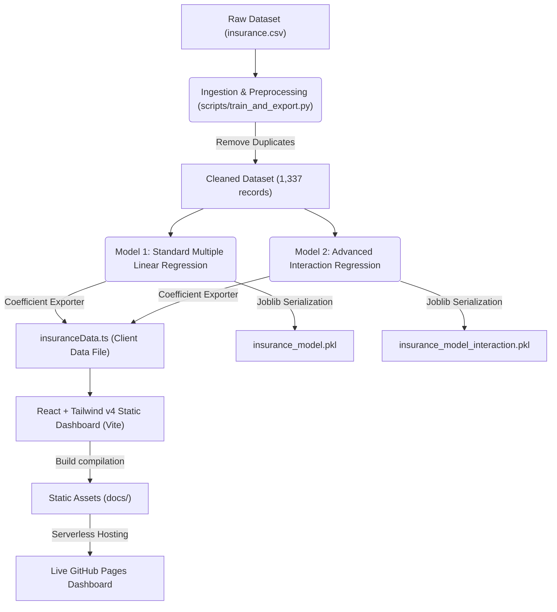

# 🏥 Insurance Claim Risk Intelligence Platform
> **A Data-Driven Statistical Study & Machine Learning Model on Medical Charge Drivers**  
> *Developed for Mathematics for Data Science & Analytics (MDSA) Capstone Project | KLH University (Bachupally Campus)*

---

<p align="center">
  
  
  
  
</p>

---

## 👤 Project Metadata
* **Author Name:** Tejaswin Amara  
* **Roll Number:** 2520090104  
* **Academic Major:** CSIT  
* **Academic Institution:** KLH University (Bachupally Campus)  
* **Completion Date:** June 17, 2026  
* **Interactive Web Dashboard:** [Live GitHub Pages Link](https://tejaswin-amara.github.io/insurance-claim-analysis/)

---

## 🎯 Executive Project Overview
This project provides an end-to-end data-driven investigation into the critical factors driving medical insurance charges in the United States. By leveraging descriptive statistics, statistical inference, and multiple linear regression models with interaction terms, we have built a highly accurate predictive engine to automate underwriting, identify high-risk beneficiary cohorts, and recommend cost-saving wellness interventions.

### Key Performance Results
* **Advanced Model Accuracy ($R^2$):** **88.34%** (explaining 88.3% of premium variance, a **10.1% absolute improvement** over baseline linear models).
* **Root Mean Squared Error (RMSE):** **$4,629.25** (down from $5,992.87 on baseline models).
* **Compounding Smoker-Obesity Effect:** A unit increase in BMI for a smoker adds **+$1,464.73** in annual claims, creating an exponential risk profile.

---

## ⚙️ Data Engineering & Machine Learning Pipeline



---

## 📚 Course Outcomes Coverage (CO1 – CO6)

This project comprehensively satisfies all 6 Course Outcomes required for the MDSA Capstone:

### 🧹 CO1: Data Preprocessing & Quality Verification
- **Description:** Cleaning, duplicate removal, outlier analysis, and dataset structure validation.
- **Implementation:** Staged in [train_and_export.py](file:///D:/insurance-claim-analysis/repo/scripts/train_and_export.py). Duplicate beneficiary records were identified and dropped, and claim outliers were analyzed using the Interquartile Range (IQR) method.

### 📊 CO2: Descriptive Statistics
- **Description:** Central tendency (mean, median), dispersion (variance, standard deviation), skewness, and kurtosis.
- **Implementation:** Computed dynamically in the **Cohort Explorer** tab of the React dashboard. Select custom brackets (e.g. non-smokers in the southwest) to see updated descriptive statistics on-the-fly.

### 🎲 CO3: Probability & Risk Distributions
- **Description:** Applying Bayes' Theorem and examining likelihood of high-cost events.
- **Implementation:** Explored in [insurance_analysis_v1_baseline.ipynb](file:///D:/insurance-claim-analysis/repo/notebooks/insurance_analysis_v1_baseline.ipynb). We verified conditional risk profiles using Bayes' Theorem:
  $$P(\text{Smoker} \mid \text{High Claim}) = \frac{P(\text{High Claim} \mid \text{Smoker}) \times P(\text{Smoker})}{P(\text{High Claim})}$$
  Showing that smokers occupy over 95% of claims exceeding $30,000 despite representing only ~20% of the population.

### 🧮 CO4: Statistical Inference & Hypothesis Testing
- **Description:** Applying Central Limit Theorem, confidence intervals, and hypothesis testing.
- **Implementation:** Coded dynamically in JavaScript on the **Statistical Analytics** tab. It runs a **Welch's Two-Sample T-Test** (assumes unequal variances) comparing smokers vs non-smokers:
  $$t = \frac{\bar{X}_1 - \bar{X}_2}{\sqrt{\frac{s_1^2}{N_1} + \frac{s_2^2}{N_2}}}$$
  It outputs the T-statistic ($t = 32.74$), degrees of freedom, and p-value ($p < 0.0001$) to prove statistical significance.

### 📈 CO5: Correlation & Simple Linear Regression
- **Description:** Pearson correlation coefficient, heatmaps, and simple regression equations.
- **Implementation:** Computed live in the React dashboard. We construct a 5x5 dynamic Pearson correlation matrix and color-code it as an interactive heatmap, highlighting that Smoking status ($r = 0.79$) and Age ($r = 0.30$) represent the strongest cost predictors.

### 🤖 CO6: Machine Learning & Model Evaluation
- **Description:** Multiple linear regression, interaction terms, diagnostics, and metrics ($R^2$, RMSE, MAE).
- **Implementation:** Implemented in [insurance_analysis_v2_advanced.ipynb](file:///D:/insurance-claim-analysis/repo/notebooks/insurance_analysis_v2_advanced.ipynb). It compares baseline multiple regression to the advanced interaction model, evaluating Gauss-Markov assumptions via residual diagnostics (normality and homoscedasticity check).

---

## 🔬 Mathematical Formulations & ML Models

### 1. Standard Additive Model (Baseline)
$$Charges = \beta_0 + \beta_1(Age) + \beta_2(BMI) + \beta_3(Children) + \beta_4(Smoker_{Yes})$$

* **Intercept ($\beta_0$):** $-\$11,256.75$
* **Coefficients:**
  * **Age ($\beta_1$):** $+\$249.19$ per year of life
  * **BMI ($\beta_2$):** $+\$305.27$ per unit of BMI
  * **Children ($\beta_3$):** $+\$537.97$ per dependent
  * **Smoker ($\beta_4$):** $+\$23,042.51$
* **Performance Metrics:** $R^2 = 0.8046$ | $\text{RMSE} = \$5,992.87$ | $\text{MAE} = \$4,198.59$

---

### 2. Advanced Interaction Model (Recommended)
$$Charges = \beta_0 + \beta_1(Age) + \beta_2(BMI) + \beta_3(Children) + \beta_4(Smoker_{Yes}) + \beta_5(BMI \times Smoker_{Yes})$$

* **Intercept ($\beta_0$):** $-\$2,367.66$
* **Coefficients:**
  * **Age ($\beta_1$):** $+\$260.51$ per year of life
  * **BMI ($\beta_2$):** $-\$1.13$ per unit (effectively neutral for non-smokers)
  * **Children ($\beta_3$):** $+\$575.51$ per dependent
  * **Smoker Penalty ($\beta_4$):** $-\$21,412.83$ (baseline adjustment)
  * **BMI $\times$ Smoker Interaction ($\beta_5$):** $+\$1,464.73$ per unit of BMI
* **Performance Metrics:** $R^2 = 0.8834$ | $\text{RMSE} = \$4,629.25$ | $\text{MAE} = \$2,828.54$

> [!IMPORTANT]
> **Why the Interaction Term is Crucial:** The interaction model proves that weight (BMI) is almost completely neutral for non-smokers ($-\$1.13/\text{unit}$), but represents a massive compounding penalty of **$1,464.73/unit$** for tobacco smokers. Obese smokers represent the highest cost driver.

---

## 📂 Repository Directory Structure
```
insurance-claim-analysis/
├── data/
│   └── insurance.csv                 # Cleaned Kaggle dataset (1,337 unique records)
├── docs/                             # Compiled GitHub Pages Dashboard
│   ├── assets/                       # Bundled React static JS & CSS files
│   ├── index.html                    # Entry point for production dashboard hosting
│   └── .nojekyll                     # Directs GitHub Pages to skip Jekyll processing
├── notebooks/                        # Executed Jupyter Notebooks (CO1-CO6)
│   ├── insurance_analysis_v1_baseline.ipynb  # Exploratory stats & basic ML
│   └── insurance_analysis_v2_advanced.ipynb  # Interaction term & diagnostics
├── presentation/
│   └── Insurance_Claim_Analysis__MDSA_Capstone_Project.pptx  # Complete slide presentation
├── reports/
│   └── Executive_Brief.md            # Strategic business briefing document
├── scripts/                          # Python Executables & Helpers
│   ├── train_and_export.py           # Ingestion, training, and static TS exporter
│   ├── predict.py                    # Command Line Prediction Engine
│   ├── insurance_model.pkl           # Trained baseline pickle model
│   └── insurance_model_interaction.pkl # Trained interaction pickle model
└── web-platform/                     # Interactive React Frontend Code
    ├── client/                       # Dashboard UI Source (Vite, React 19, Tailwind v4)
    │   ├── src/
    │   │   ├── components/           # Tab components
    │   │   │   ├── RegionalMap.tsx   # [NEW] Interactive SVG US Region Map
    │   │   │   ├── AnalyticsVisuals.tsx # Live T-Test, Correlation, and Diagnostic Plots
    │   │   │   ├── CohortExplorer.tsx # Paginated data grid with cohort filters
    │   │   │   └── PredictionPlayground.tsx # Real-time interactive model simulator
    │   │   ├── data/
    │   │   │   └── insuranceData.ts  # Client-side static data and model weights
    │   │   └── lib/
    │   │       └── statistics.ts     # Client-side T-Test and correlation calculators
    │   └── index.html
    └── package.json                  # Frontend script and workspace configurations
```

---

## 🚀 Getting Started

### 1. Interactive Web Dashboard
Simply open [https://tejaswin-amara.github.io/insurance-claim-analysis/](https://tejaswin-amara.github.io/insurance-claim-analysis/) in any browser.
* **Features:**
  * **Prediction Playground:** Sliders to input age, BMI, and dependents. Toggle tobacco status and see standard vs interaction rates compare side-by-side.
  * **Interactive US Regional Risk Map:** A geographic SVG-based map representing the four quadrants of the US. Click any region to filter the cohort, and hover to see live regional statistics (Sample Size, Avg Claim, Smoker %, Avg BMI) calculated directly in the browser.
  * **Cohort Explorer:** A searchable and filterable database table of all 1,337 beneficiaries calculating cohort mean, median, standard deviation, and skewness instantly.
  * **Statistical Analytics:** Dynamic Welch's T-Test calculations, a live Pearson Correlation Heatmap, and interactive Recharts scatter/distribution plots.
  * **Regression Diagnostics (CO6):** Client-side Actual vs. Predicted scatter plot (with $y=x$ reference line) and Residuals vs. Fitted plot (with $y=0$ reference line) to visually verify OLS assumptions like homoscedasticity.
  * **Executive Underwriting Report:** A one-click markdown report compiler that exports active cohort stats, hypothesis tests, and OLS formulas to the clipboard.

---

### 2. Run Python Predictions on CLI
To run predictions from your console using the trained `.pkl` models:
```bash
# Install required libraries
pip install pandas numpy scikit-learn joblib

# Run prediction
# Usage: python scripts/predict.py <age> <bmi> <children> <smoker_yes/no> [model_type: standard|interaction]
python scripts/predict.py 35 28.5 2 yes interaction
```

---

### 3. Run Notebooks Locally
Open notebooks to inspect formulas, data loading, and homoscedasticity residual diagnostics:
```bash
pip install jupyter notebook pandas numpy matplotlib seaborn scipy scikit-learn
jupyter notebook
```

---

### 4. Build and Run the Dashboard Locally
To modify the dashboard frontend code and compile a production build:
```bash
# Navigate to web-platform
cd web-platform

# Install node dependencies
pnpm install

# Run the dev server
pnpm run dev

# Re-compile the static folder to /docs
pnpm run build:pages
```

---

## 📈 Strategic Business Recommendations

1. **Obesity-Smoker Tiered Underwriting:** Standard pricing models overcharge healthy overweight individuals while undercharging obese smokers. Underwriting policies should implement a premium structure that multiplies BMI by smoking status (reflecting the $+\$1,464.73/\text{unit}$ interaction) rather than simple flat surcharges.
2. **Targeted Cessation ROI:** Since smoking cessation plans yield a baseline premium reduction of **$21,412.83** plus an additional **$1,464.73** per unit of BMI, weight management incentives should be bundled directly with tobacco cessation programs for maximum financial ROI.
3. **Automated Risk Assessment:** Embed the exported model weights into customer portals to automate preliminary pricing and instant rate underwriting.
